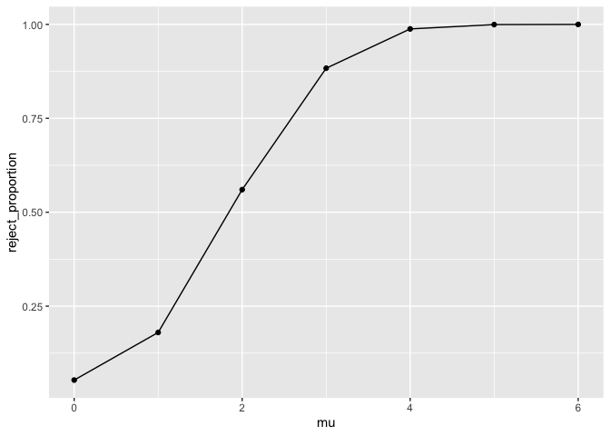
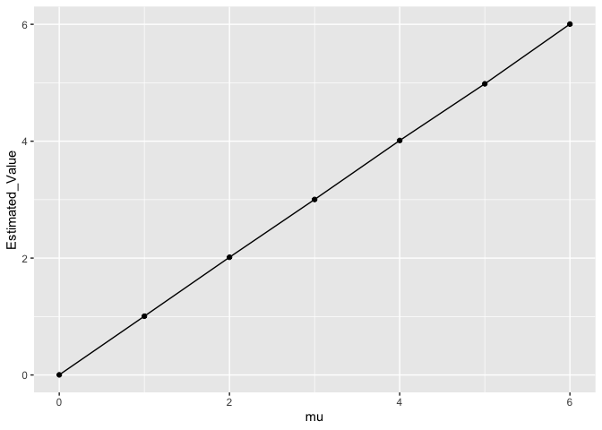

P8105 Homework 5
================
Zihan Yu

## Problem 2

Start with a dataframe containing all file names

    ##                                                                         fileNames
    ## 1  /Users/zihanyu/Documents/P8105_Data Science 1/p8105_hw5_zy2443/data/con_01.csv
    ## 2  /Users/zihanyu/Documents/P8105_Data Science 1/p8105_hw5_zy2443/data/con_02.csv
    ## 3  /Users/zihanyu/Documents/P8105_Data Science 1/p8105_hw5_zy2443/data/con_03.csv
    ## 4  /Users/zihanyu/Documents/P8105_Data Science 1/p8105_hw5_zy2443/data/con_04.csv
    ## 5  /Users/zihanyu/Documents/P8105_Data Science 1/p8105_hw5_zy2443/data/con_05.csv
    ## 6  /Users/zihanyu/Documents/P8105_Data Science 1/p8105_hw5_zy2443/data/con_06.csv
    ## 7  /Users/zihanyu/Documents/P8105_Data Science 1/p8105_hw5_zy2443/data/con_07.csv
    ## 8  /Users/zihanyu/Documents/P8105_Data Science 1/p8105_hw5_zy2443/data/con_08.csv
    ## 9  /Users/zihanyu/Documents/P8105_Data Science 1/p8105_hw5_zy2443/data/con_09.csv
    ## 10 /Users/zihanyu/Documents/P8105_Data Science 1/p8105_hw5_zy2443/data/con_10.csv
    ## 11 /Users/zihanyu/Documents/P8105_Data Science 1/p8105_hw5_zy2443/data/exp_01.csv
    ## 12 /Users/zihanyu/Documents/P8105_Data Science 1/p8105_hw5_zy2443/data/exp_02.csv
    ## 13 /Users/zihanyu/Documents/P8105_Data Science 1/p8105_hw5_zy2443/data/exp_03.csv
    ## 14 /Users/zihanyu/Documents/P8105_Data Science 1/p8105_hw5_zy2443/data/exp_04.csv
    ## 15 /Users/zihanyu/Documents/P8105_Data Science 1/p8105_hw5_zy2443/data/exp_05.csv
    ## 16 /Users/zihanyu/Documents/P8105_Data Science 1/p8105_hw5_zy2443/data/exp_06.csv
    ## 17 /Users/zihanyu/Documents/P8105_Data Science 1/p8105_hw5_zy2443/data/exp_07.csv
    ## 18 /Users/zihanyu/Documents/P8105_Data Science 1/p8105_hw5_zy2443/data/exp_08.csv
    ## 19 /Users/zihanyu/Documents/P8105_Data Science 1/p8105_hw5_zy2443/data/exp_09.csv
    ## 20 /Users/zihanyu/Documents/P8105_Data Science 1/p8105_hw5_zy2443/data/exp_10.csv

Iterate over file names and read in data for each subject using
purrr::map and saving the result as a new variable in the dataframe

``` r
library(purrr)
fileDataframe<-unlist(fileNames)%>%map(read.csv)
library(data.table)
```

    ## 
    ## Attaching package: 'data.table'

    ## The following object is masked from 'package:purrr':
    ## 
    ##     transpose

``` r
fileDataframeT<-rbindlist(fileDataframe)
fileNames<-cbind(fileNames,fileDataframeT)
```

Tidy the result; manipulate file names to include control arm and
subject ID

``` r
dataCon<-fileDataframeT[grep("con",fileNames[[1]]),]
```

According to the output of the following figure, we find that the
experiment group were with higher value than that of control group.

``` r
library(ggplot2)
armGroup<-rep(0,20)
armGroup[grep("con",fileNames[1])]<-"1";
armGroup[-grep("con",fileNames[1])]<-"2";
armGroup<-rep(as.factor(armGroup),each=8);
subjectIDs<-rep(as.factor(rep(1:10,2)),each=8)
weekPlot<-rep(1:8,20);
valuesPlot<-unname(unlist(fileDataframeT))
dataPlot<-as.data.frame(cbind(armGroup=armGroup,subjectIDs=subjectIDs,weekPlot=weekPlot,valuesPlot=valuesPlot))
ggplot(dataPlot, aes(weekPlot, valuesPlot, group = armGroup))+geom_point() +  geom_line(aes(colour = armGroup))
```

<!-- -->

## Problem 3

For each dataset, save μ^and the p-value arising from a test of H:μ=0
using α=0.05

``` r
library(broom)
pValues<-rep(0,5000)
estiMu<-rep(0,5000)
for(i in 1:5000)
{
  tempData<-rnorm(30,mean=0,sd=5);
  tempTest<-tidy(t.test(tempData,mu=0));
  estiMu[i]<-tempTest$estimate;
  pValues[i]<-tempTest$p.value;
}
sum(pValues<0.05)/5000
```

    ## [1] 0.0532

Repeat the above for μ={1,2,3,4,5,6}, and complete the following:

``` r
 geneMuP<-function(mu)
 {
  pValues<-rep(0,5000);
  estiMu<-rep(0,5000)
  for(i in 1:5000)
  {
    tempData<-rnorm(30,mean=mu,sd=5);
    tempTest<-tidy(t.test(tempData,mu=0));
    estiMu[i]<-tempTest$estimate;
    pValues[i]<-tempTest$p.value;
  }
  return(cbind(estiMu,pValues))
 }
out1<-geneMuP(1)
out2<-geneMuP(2)
out3<-geneMuP(3)
out4<-geneMuP(4)
out5<-geneMuP(5)
out6<-geneMuP(6)
sum(out1[,2]<0.05)/5000
```

    ## [1] 0.18

``` r
sum(out2[,2]<0.05)/5000
```

    ## [1] 0.5602

``` r
sum(out3[,2]<0.05)/5000
```

    ## [1] 0.8834

``` r
sum(out4[,2]<0.05)/5000
```

    ## [1] 0.988

``` r
sum(out5[,2]<0.05)/5000
```

    ## [1] 0.9996

``` r
sum(out6[,2]<0.05)/5000
```

    ## [1] 1

Make a plot showing the proportion of times the null was rejected (the
power of the test) on the y axis and the true value of μ on the x axis.
Describe the association between effect size and power.

They are positive associated, when effect size increases the power
increases

``` r
library(ggplot2)
X<-0:6
Y<-c(sum(pValues<0.05)/5000,sum(out1[,2]<0.05)/5000,sum(out2[,2]<0.05)/5000,sum(out3[,2]<0.05)/5000,sum(out4[,2]<0.05)/5000,sum(out5[,2]<0.05)/5000,sum(out6[,2]<0.05)/5000)
XYPlot<-as.data.frame(cbind(mu=X,reject_proportion=Y))
ggplot(XYPlot, aes(mu, reject_proportion))+geom_point() +  geom_line()
```

<!-- -->

Make a plot showing the average estimate of μ^ on the y axis and the
true value of μ on the x axis. Make a second plot (or overlay on the
first) the average estimate of μ^ only in samples for which the null was
rejected on the y axis and the true value of μ on the x axis. Is the
sample average of μ^ across tests for which the null is rejected
approximately equal to the true value of μ ? Why or why not?

Yes, it is shown by the following figure. This is because the samples
are randomly generated from the model N(u,sd).

``` r
library(ggplot2)
X<-0:6
Y<-colMeans(cbind(estiMu,out1[,1],out2[,1],out3[,1],out4[,1],out5[,1],out6[,1]))
XYPlot<-as.data.frame(cbind(mu=X,Estimated_Value=Y))
ggplot(XYPlot, aes(mu, Estimated_Value))+geom_point() +  geom_line()
```

<!-- -->
