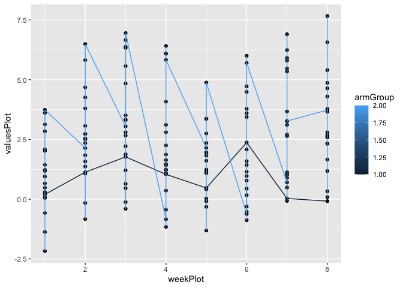

P8105 Homework 5
================
Zihan Yu

## Problem 2

Start with a dataframe containing all file names

    ##                                                                         fileNames
    ## 1  /Users/zihanyu/Documents/P8105_Data Science 1/p8105_hw5_zy2443/data/con_01.csv
    ## 2  /Users/zihanyu/Documents/P8105_Data Science 1/p8105_hw5_zy2443/data/con_02.csv
    ## 3  /Users/zihanyu/Documents/P8105_Data Science 1/p8105_hw5_zy2443/data/con_03.csv
    ## 4  /Users/zihanyu/Documents/P8105_Data Science 1/p8105_hw5_zy2443/data/con_04.csv
    ## 5  /Users/zihanyu/Documents/P8105_Data Science 1/p8105_hw5_zy2443/data/con_05.csv
    ## 6  /Users/zihanyu/Documents/P8105_Data Science 1/p8105_hw5_zy2443/data/con_06.csv
    ## 7  /Users/zihanyu/Documents/P8105_Data Science 1/p8105_hw5_zy2443/data/con_07.csv
    ## 8  /Users/zihanyu/Documents/P8105_Data Science 1/p8105_hw5_zy2443/data/con_08.csv
    ## 9  /Users/zihanyu/Documents/P8105_Data Science 1/p8105_hw5_zy2443/data/con_09.csv
    ## 10 /Users/zihanyu/Documents/P8105_Data Science 1/p8105_hw5_zy2443/data/con_10.csv
    ## 11 /Users/zihanyu/Documents/P8105_Data Science 1/p8105_hw5_zy2443/data/exp_01.csv
    ## 12 /Users/zihanyu/Documents/P8105_Data Science 1/p8105_hw5_zy2443/data/exp_02.csv
    ## 13 /Users/zihanyu/Documents/P8105_Data Science 1/p8105_hw5_zy2443/data/exp_03.csv
    ## 14 /Users/zihanyu/Documents/P8105_Data Science 1/p8105_hw5_zy2443/data/exp_04.csv
    ## 15 /Users/zihanyu/Documents/P8105_Data Science 1/p8105_hw5_zy2443/data/exp_05.csv
    ## 16 /Users/zihanyu/Documents/P8105_Data Science 1/p8105_hw5_zy2443/data/exp_06.csv
    ## 17 /Users/zihanyu/Documents/P8105_Data Science 1/p8105_hw5_zy2443/data/exp_07.csv
    ## 18 /Users/zihanyu/Documents/P8105_Data Science 1/p8105_hw5_zy2443/data/exp_08.csv
    ## 19 /Users/zihanyu/Documents/P8105_Data Science 1/p8105_hw5_zy2443/data/exp_09.csv
    ## 20 /Users/zihanyu/Documents/P8105_Data Science 1/p8105_hw5_zy2443/data/exp_10.csv

Iterate over file names and read in data for each subject using
purrr::map and saving the result as a new variable in the dataframe

``` r
library(purrr)
fileDataframe<-unlist(fileNames)%>%map(read.csv)
library(data.table)
```

    ## 
    ## Attaching package: 'data.table'

    ## The following object is masked from 'package:purrr':
    ## 
    ##     transpose

``` r
fileDataframeT<-rbindlist(fileDataframe)
fileNames<-cbind(fileNames,fileDataframeT)
```

Tidy the result; manipulate file names to include control arm and
subject ID

``` r
dataCon<-fileDataframeT[grep("con",fileNames[[1]]),]
```

According to the output of the following figure, we find that the
experiment group were with higher value than that of control group.

``` r
library(ggplot2)
armGroup<-rep(0,20)
armGroup[grep("con",fileNames[1])]<-"1";
armGroup[-grep("con",fileNames[1])]<-"2";
armGroup<-rep(as.factor(armGroup),each=8);
subjectIDs<-rep(as.factor(rep(1:10,2)),each=8)
weekPlot<-rep(1:8,20);
valuesPlot<-unname(unlist(fileDataframeT))
dataPlot<-as.data.frame(cbind(armGroup=armGroup,subjectIDs=subjectIDs,weekPlot=weekPlot,valuesPlot=valuesPlot))
ggplot(dataPlot, aes(weekPlot, valuesPlot, group = armGroup))+geom_point() +  geom_line(aes(colour = armGroup))
```

<!-- -->
